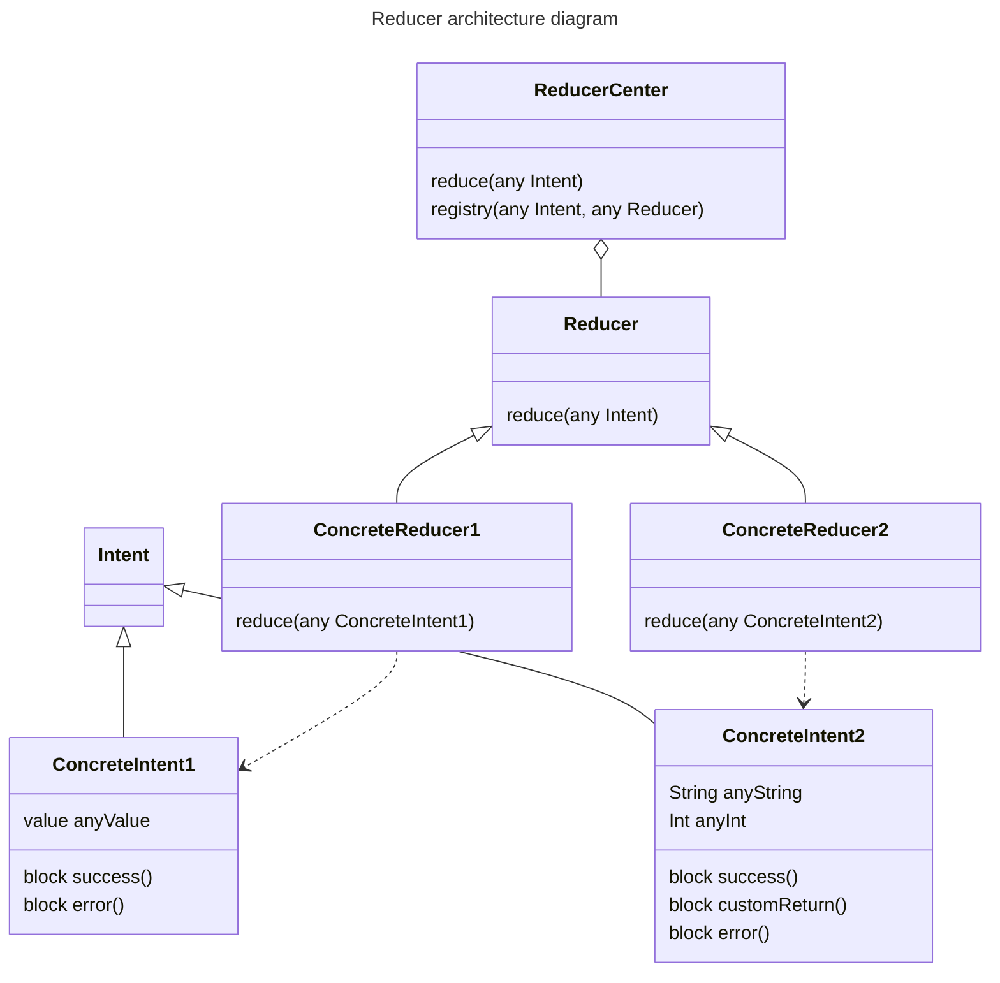

[](https://codebeat.co/projects/github-com-madcato-ios-boilerplate-master)

# iOS Boilerplate

This project includes some basic source codes, configurations and external integrations to start a basic iOS project

## Features included

### Files

- README.md (this file)
- CHANGELOG [How to keep a CHANGELOG](https://keepachangelog.com/en/0.3.0/)
- CONTRIBUTING.md (sample file from **Ruby On Rails**)
- LICENSE (initially MIT license)
- .gitignore (created with [gitignore.io](http://www.gitignore.io))

### Configuration

- Basic project directory estructure

```
Project
│
└───iOS-Boilerplate
│   │
│   └───Startup                // App start related classes, like Migrations
│   │   │   AppDelegate.swift
│   │   │
│   │   └───Migration          // Classes and models for persisted data migrations
│   │                          //  between versions
│   │
|   └───Features               // Features must be the real base of hole app.
|   |   |
|   |   └───SampleFeature1     // Each feature will have its own subdirectory structure
│   │
│   └───Shared                 // keep in this group all shared code between features
│   │   │
│   │   └───Configuration      // Classes with the app configuration, like serverURL 
│   │   └───Model              // Shared data model. Each Features will have its own models
│   │   └───Services
│   │   └───Extensions
│   │
│   └───Resources               // Resource files, like images, grouped by type
│       │
│       └───Environments        // Plist files with the configuration of each environment
│       │   │
│       │   └───Pro
│       │   │   └enviroments.plist
│       │   │
│       │   └───Dev
│       │   │   └enviroments.plist
│       │   │
│       │   └───UAT
│       │       └enviroments.plist
│       │
│       └───pdf
│       └───certificates
│       └───html
│       └───json
│       └───video
│       └───plist
│   
│
└───Frameworks                // External projects, Swift Pacages, libraries and frameworks
│    │
│    └───CoreMotion.framework
│    │   libz.dylib
│    │   libarichive.framework
│    │
│    └───Security.framework
│
└───iOS-BoilerplateTests
│
└───iOS-BoilerplateUITests
│
└───Products
```

### Sample codes

- [Swift 4 json parsing and creating](https://grokswift.com/json-swift-4/) _(See class Library/Model/PersonDTO.swift)_
- Multi environment configurations [Using Xcode Configuration (.xcconfig) to Manage Different Build Settings](https://appcoda.com/xcconfig-guide/)
- Multi language (Use Twine: https://github.com/scelis/twine)
- Web Service 
- Testing, Mocks, UI testing 
- Core Data
- Basic utils
- Theme classes (in order to make easy to control the colors of the app using UIAppearance class)
- Login made with [Clean-Swift architecture](https://clean-swift.com/)
- Login made with [Redux-iOS architecture](https://github.com/ReSwift/ReSwift)
- Rails project showing an API and a swift client sample: [Swift URLSession Experiment](https://github.com/madcato/Swift-URLSession-Experiment)

### Integrations

- [fastlane](https://fastlane.tools)
  To manage the build of the project and publish the app into TestFlight and App Store
- [Swiftlint](https://github.com/realm/SwiftLint)
  To analyze statically code quality

#### Furture integrations

- [Dangerfile](https://github.com/danger/swift)
  To add automated customized rules to the process of Pull Request.
- [FormatterKit](https://github.com/mattt/FormatterKit)
  ```stringWithFormat:``` for the sophisticated hacker set
- [Crashlytics/Fabric](https://fabric.io/kits/ios/crashlytics/manual-install)
- [Turbolinks](https://github.com/turbolinks/turbolinks-ios)
  Mix web view controllers and native controllers to create hibrids apps without the hell of angular.js  

## Project wiki

- [Swift style guide](wiki) Mantain in your wiki the conventions used by your team
  [Use Linkeding swift style guide](https://github.com/linkedin/swift-style-guide)

## How To install

### Requirements

* Xcode 14+
* iOS 14+
* brew
* fastlane
* swiftlint

### Getting the source

First, check out the source, including all the dependencies:

    $ git clone --recurse-submodules https://github.com/madcato/iOS-Boilerplate

### Installing other dependencies

#### [Brew](https://brew.sh)

    $ /usr/bin/ruby -e "$(curl -fsSL https://raw.githubusercontent.com/Homebrew/install/master/install)"

#### [Fastlane](https://docs.fastlane.tools/getting-started/ios/setup/)

    $ xcode-select --install
    $ brew install fastlane

#### [SwiftLint](https://github.com/realm/SwiftLint)

    $ brew install swiftlint

Configure SwiftLint editing file `.swiftlint.yml` in the root of the project.

### Build with fastlane

    $ fastlane build

The computer where fastlane is going to run must have the provissioning and private key installed

### Send app to TestFlight with fastlane

    $ fastlane beta

The computer where fastlane is going to run must have the provissioning and private key installed

### Launch tests with fastlane

    $ fastlane tests


## Recommended links

- https://medium.com/cocoaacademymag/unit-testing-network-request-3a75061fcf4c
- https://kean.github.io/post/api-client
- https://clean-swift.com/clean-swift-ios-architecture/

## Recommendations

- Use font styles instead custon or system fonts. Define de font as `Title 1`, `Body`, `Caption` see [UIFontTextStyle Apple documentation](https://developer.apple.com/documentation/uikit/uifonttextstyle). This allows users to activate Acessibility custom fonts.
- Define custom meaningful names for colors, like: `orangeAction`, `redMain`, `yellowAccent`, `brandBlue`. This way, if the designer needs to change one color, it's easier to change it in only one place.
- Use `UIAppearance` protocol to define control styles. To simplify styles management.
- Define custom a `Theme` class to define color, appearances and control styles. To allow to change theme or to create new ones.
- Define custom clases inheriting form `UIButton`, `UILabel`, etc, to define styles of controls. Examples: `MainButton` class, `CancelButton` class. Use this clases implementation (or its appearances) to define colors, layouts and fonts. Assign this classes in the `Storyboards`.
- Use `Storyboards` links to avoid creating only one big `Storyboard`, this makes compilation slower and git merging it a mess.

## Screenshots with fastlane

- [fastlane screenshots documentation](https://docs.fastlane.tools/getting-started/ios/screenshots/)

Define where to capture screens in the file `SnapshotUITest\SnapshotUITest.swift`
```swift
    func testSnapshot() {
        let app = XCUIApplication()
        snapshot("01MainScreen")
        app.navigationBars["Root View Controller"].buttons["Login"].tap()
        app.tables.buttons["Sign in"].tap()
        snapshot("02LoginScreen")
        app.alerts.scrollViews.otherElements.buttons["OK"].tap()
        snapshot("03LoginFailScreen")
    }
```

Then capture screenshots by running: `$ fastlane snapshot`

Upload those screenshots files to the App Store with: `$ fastlane deliver`

## Localization helpers

### LocalizedString

Use class **LocalizedString** to handle localizations in models and view models.

    let label = LocalizedString(label: "main_name")
    uiLabel <= label

### LocalizedLabel

This class inherits from UILabel. Use this class to auto localize the text of a label loaded from a UIStoryboard. Create a UILabel control in yout Interface Builder, then change the field "Custom class" from UILabel to LocalizedLabel, and set in the "text" field the identifier of the label to be translated.

## Architecture

Don't use a mainstream architecture because of 'everyone do it'.

One methodology to make different parts of your app indepdendent from each other y to use a **ReducerCenter**.

## Reducer architecture

- **ReducerCenter.shared** is a singleton where each object that want to reduce some operation (called intents), must registered. Any code that want a reduction of an operation, must create an object of an **Intent** subclass, initialize it and pass it to the **ReducerCenter.shared.reduce(operation: any Intent)** method.
- **Intent** Any struct that represent an operation to be reduced must implement this interface. Intents are only a way to make independent some clases: doesn't represent only to a user action, system event, notification. It can represent anything that must be reduced to other state.
- **Reducer** Any object that want to behave as a reducer of intents must implement this interface. Then it must implement the **reduce** method and be registered in the **ReducerCenter**.



### Callbacks

When a concrete reducer must answer some data to the object that started the reduction, all the data must be returned by blocks of code. This includes errors, secuences, or any custom return value. Blocks can be called asynchronously

## PR and versioning

Best method to keep a good flow of commits and merges is to use Gitlab Flow ([What is GitLab Flow?](https://about.gitlab.com/topics/version-control/what-is-gitlab-flow/)).

If your are developing alone, and you don't require to have different versions published at the same time, best is to use `main` branch as production one. Then each new feature or fix can be developed and tested in its own branch. Finally that branch can be merged directly to `main` branch to be published in the next upload to production.

To manage versions best solution is to create tags. Each time you make a PR merge, check if the new changes are a `major` change, `minor` change or a `fix`. Then follow the instructions in the following section.

Each new PR merged into `main` should be tagged with its versión, or use this version change only when publishing.

### Versioning and tagging

Usually versions have four numbers (three main, one for build if necessary), and also sometimes a suffix is needed to specify what kind of version is this.

- `major` Change this number by adding one when the changes make this version become imcompatibe with previous one, and users must create new accounts or to migrate data from one an another. What best determine this is the data integrity: if a new verision make user data incompatible with previous one, then is a **major** change. But also can use this change to specify great changes in the app, like changing entire UI.
- `minor` This number indicates one or more feature addition. But the app doesn't require data migration, or any other great change. Minor versions usually indicate that this app, library or code is compatible with previous minor versions.
- `fix` Change this number when you are adding only features fixes.
- `build` This number indicates a new build of the same code. Usually used in pre-production enviroments to help QA to identify what is the version where they found bugs.
- `suffix` This identifier usually is some text to distinguish between different compilations, like different tarjets `.arm`, `.x86`, also to mark the state of the release `.alpha`, `.beta`, `.candidate`

### Merging policy

The best merge policies are **Squash and Merge** or **Squash and Rebase** (the last one keeps `main` branch cleaner),the **squash** is really useful avoid leaving a lot of commits into the `main` branch.
